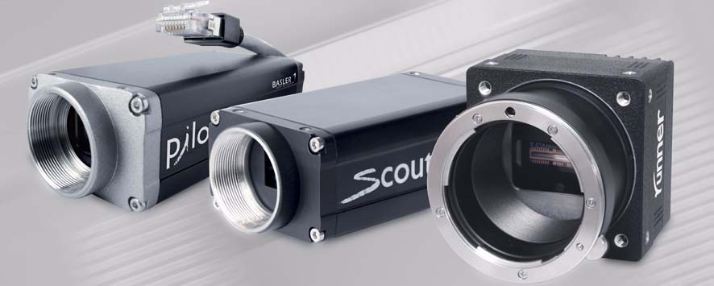

.. _camera-basler:

Basler camera
--------------



Introduction
````````````

Basler's area scan cameras are designed for industrial users who demand superior image quality and an excellent price/performance ratio. You can choose from an area scan portfolio that includes monochrome or color models with various resolutions, frame rates, and sensor technologies.

The Lima module has been tested only with this GigE cameras models:

  - Scout
  - Pilot
  - Ace

The Lima module has been tested with Pylon SDK versions **3.2.2** and **5.0.1**.

Monochrome and color cameras are supported with these SDK versions.

Installation & Module configuration
```````````````````````````````````

First, you have to install the Basler SDK *Pylon* to the default path ``/opt/pylon``.

Then, follow the generic instructions in :ref:`build_installation`. If using CMake directly, add the following flag:

.. code-block:: sh

 -DLIMACAMERA_BASLER=true

For the Tango server installation, refers to :ref:`tango_installation`.

Initialisation and Capabilities
```````````````````````````````

Implementing a new plugin for new detector is driven by the LIMA framework but the developer has some freedoms to choose which standard and specific features will be made available. This section is supposed to give you the correct information regarding how the camera is exported within the LIMA framework.

Camera initialisation
.....................

The camera will be initialized by creating Basler ::Camera object. The Basler camera can be idenfified
either by:

* IP/hostname (examples: ``ip://192.168.5.2``, ``ip://white_beam_viewer1.esrf.fr``) or
* Basler serial number (example: ``sn://12345678``) or
* Basler user name (example: ``uname://white_beam_viewer1``)

In case an IP is given, the ``ip://`` scheme prefix is optional.

Only the camera ID is mandatory.

Small example showing possible ways to initialize:

.. code-block:: python

  from Lima import Basler
  from lima import Core

  # From an IP (notice ip:// prefix is optional)
  cam = Basler.Camera('192.168.5.2')

  # From a basler serial number
  cam = Basler.Camera('sn://12345678')

  # From a basler user name
  cam = Basler.Camera('uname://white_beam_viewer1')


Std capabilites
...............

This plugin has been implemented in respect of the mandatory capabilites but with some limitations which
are due to the camera and SDK features. Only restriction on capabilites are documented here.

* HwDetInfo

  getCurrImageType/getDefImageType(): it can change if the video mode change (see HwVideo capability).

  setCurrImageType(): It only supports Bpp8 and Bpp16.

* HwSync

  get/setTrigMode(): the supported mode are IntTrig, IntTrigMult, ExtTrigMult and ExtGate.

Optional capabilites
....................

In addition to the standard capabilities, we make the choice to implement some optional capabilities which
are supported by the SDK. **Video**,  Roi and Binning are available.

* HwVideo

  The basler cameras are pure video device, so video format for image are supported:

  **Color cameras ONLY**
   - BAYER_RG8
   - BAYER_BG8
   - BAYER_RG16
   - BAYER_BG16
   - RGB24
   - BGR24
   - RGB32
   - BGR32
   - YUV411
   - YUV422
   - YUV444

  **Color and Monochrome cameras**
   - Y8
   - Y16

  Use get/setMode() methods of the *video* object (i.e. CtControl::video()) to read or set the format.

* HwBin

  There is no restriction for the binning up to the maximum size.

* HwRoi

  There is no restriction for the Roi up to the maximum size.


Configuration
`````````````

- First you need to decide how you want to reference your camera (by IP/hostname, serial number or user name)

- Second, you have to setup the IP address of the Basler Camera by using *IpConfigurator* (``/opt/pylon/bin/IpConfigurator``)
  or by matching the MAC address with a choosen IP into the DHCP. If you plan to reference the camera by
  user name you should also set it in *IpConfigurator*. If you plan to reference the camera by serial number
  you should note down the serial number that appears in the label of your camera.

- Then in the Basler Tango device, set the property *camera_id* according to the type of ID you choose
  (see :ref:`lima-tango-basler` for more details)

- If you are running the server with linux kernel >= 2.6.13, you should add this line into */etc/security/limits.conf*. With this line, the acquisition thread will be in real time mode.

.. code-block:: sh

  USER_RUNNING_DEVICE_SERVER	-	rtprio	99


How to use
``````````

This is a python code example for a simple test:

.. code-block:: python

  from Lima import Basler
  from lima import Core

  #----------------------------------------+
  #                        packet-size     |
  #                                        |
  #-------------------------------------+  |
  #              inter-packet delay     |  |
  #                                     |  |
  #----------------------------------+  |  |
  #      frame-transmission delay    |  |  |
  #                                  |  |  |
  #--------------------+             |  |  |
  # cam ip or hostname |             |  |  |
  #                    v             v  v  v
  cam = Basler.Camera('192.168.1.1', 0, 0, 8000)

  hwint = Basler.Interface(cam)
  ct = Core.CtControl(hwint)

  acq = ct.acquisition()


  # set and test video
  #

  video=ct.video()
  video.setMode(Core.RGB24)
  video.startLive()
  video.stopLive()
  video_img = video.getLastImage()

  # set and test an acquisition
  #

  # setting new file parameters and autosaving mode
  saving=ct.saving()

  pars=saving.getParameters()
  pars.directory='/buffer/lcb18012/opisg/test_lima'
  pars.prefix='test1_'
  pars.suffix='.edf'
  pars.fileFormat=Core.CtSaving.TIFF
  pars.savingMode=Core.CtSaving.AutoFrame
  saving.setParameters(pars)

  # now ask for 2 sec. exposure and 10 frames
  acq.setAcqExpoTime(2)
  acq.setNbImages(10)

  ct.prepareAcq()
  ct.startAcq()

  # wait for last image (#9) ready
  lastimg = ct.getStatus().ImageCounters.LastImageReady
  while lastimg !=9:
    time.sleep(1)
    lastimg = ct.getStatus().ImageCounters.LastImageReady

  # read the first image
  im0 = ct.ReadImage(0)
